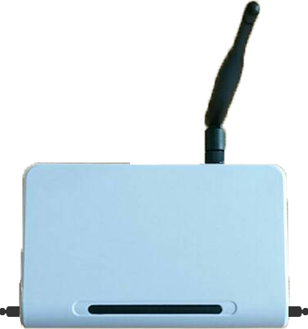

# 基本概念

## 概述

完整的 WebDriver 层级顺序包含下面5个部分：
> 应用 &longrightarrow; 页面 &longrightarrow; 组件 &longrightarrow; 变量 &longrightarrow; 驱动

*应用中包含页面，页面中包含组件，组件中包含变量，驱动通过变量来控制组件动作*

因此，使用WebDriver的流程是：
- 创建应用
- 创建页面
- 添加组件
- 获取变量
- 编写驱动

## 应用
在应用管理中创建应用、删除应用、修改应用基本信息

> 同一应用中的所有页面宽度相同

例如，创建一个PC应用，其中每个页面的宽度都是1440px，高度可调。在不同分辨率的PC上运行时，WebDriver页面会适应屏幕的宽度，而页面高度则根据比例会自动调整，超出屏幕高度时会出现滚动条。
如果一个系统中需要有PC和手机，则需要创建两个应用，分别配置各自的页面尺寸。

> 应用和SDK驱动可以有多种对应关系

- 一个应用对应一个SDK驱动
- 多个应用对应一个SDK驱动
- 一个应用对应多个SDK驱动

## 页面
页面是显示组件的载体
在应用中添加页面、删除页面、向页面中拖放显示组件
- 在页面上拖放要显示的组件
- 通过SDK驱动控制页面的显示、隐藏、切换

## 组件
组件是显示的最小单元
一个页面可以放置多个组件

- 组件分为装饰类、显示类、输入类、容器类、布局类、结构类等
不同类别的组件，能够组成各种操作界面
- 组件隶属于父级页面，当页面隐藏时，其中的组件全部隐藏

## 变量
每个组件都包含一个或多个变量，组件和SDK驱动之间通过变量相互控制
- 组件被触发时，会向SDK驱动推送变量值变通知，SDK驱动收到后可以做相应的处理
- SDK驱动向组件的变量发送控制命令，修改变量的值，组件会产生相应的动作变化

## 驱动
驱动用来调用平台接口，控制显示组件变量，接收显示组件变量值变
驱动就是后台程序
- 可以根据API协议编写驱动，也可以使用SDK包编写驱动
- 可以让驱动运行在PC、仪器设备、云平台等载体上
- 可以让驱动连接数据库，处理后台业务逻辑，将结果发送到页面组件上，形成应用系统

